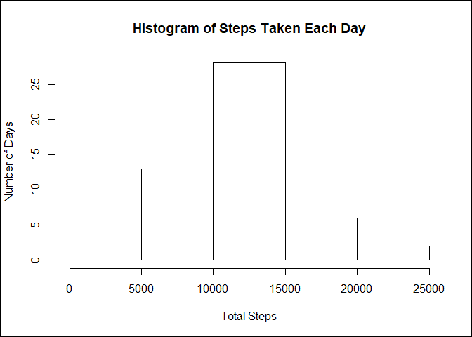
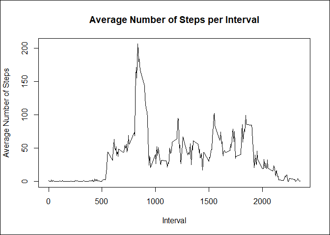
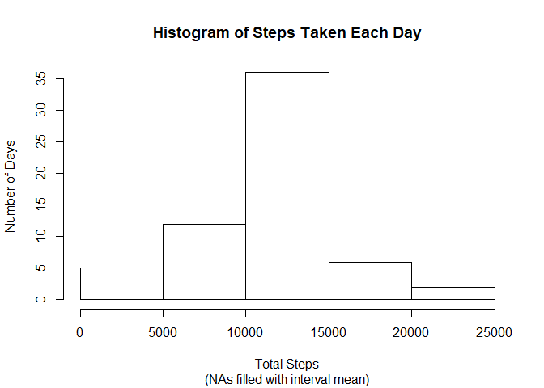
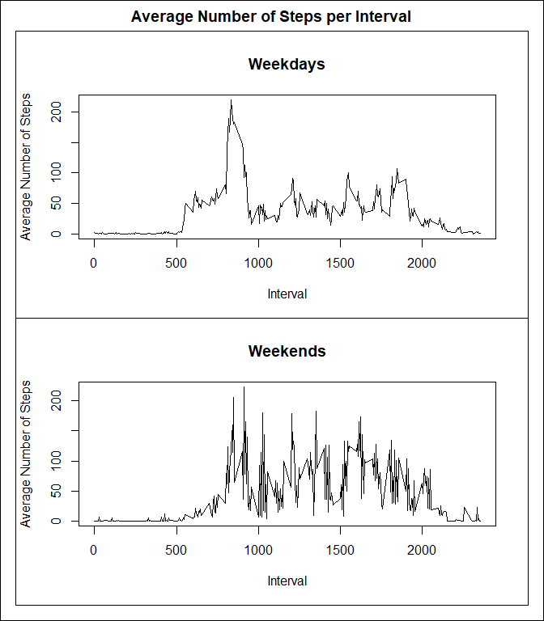

***
## Loading and preprocessing the data
To analyze the activity data, it must first be downloaded and processed.  
After loading the `dplyr` library, check to see if the file exists and download.  


```r
library(dplyr)

if (!file.exists("./activity.zip")) {
  download.file("https://d396qusza40orc.cloudfront.net/repdata%2Fdata%2Factivity.zip", 
                "./activity.zip")
}
```
Next load the newly downloaded dataset into a data frame called `activity_data`.

```r
activity_data <- read.table(unz("activity.zip", "activity.csv"), 
                              header = TRUE, 
                              sep = ",",
                              na.strings = "NA", 
                              colClasses = c("numeric", "character", "numeric"))
```
Reclass the `date` field to a `POSIXct` data class so we can process properly.

```r
activity_data$date <- as.POSIXct(strptime(activity_data$date, format = "%Y-%m-%d", tz = "UTC"))
```
***
## What is mean total number of steps taken per day?
Let's first summarize the `activity_data` by date and sum the `steps` taken into another data frame `total_steps_per_day`.

```r
total_steps_per_day <- activity_data %>% group_by(date) %>% summarize(total_steps = sum(steps, na.rm = TRUE))
```
Using `total_steps_per_day`, we can now create a histogram that shows the steps taken for a given range of steps.  

```r
hist(total_steps_per_day$total_steps, 
     main = "Histogram of Steps Taken Each Day", 
     xlab = "Total Steps", ylab = "Number of Days")

box(which = "outer", lty = 1)
```

<!-- -->

We can also calculate the mean and median of the total number of steps taken per day:  
*mean*

```r
mean(total_steps_per_day$total_steps, na.rm = TRUE)
```

```
## [1] 9354.23
```
*median*

```r
median(total_steps_per_day$total_steps, na.rm = TRUE)
```

```
## [1] 10395
```

***
## What is the average daily activity pattern?
Let's create a data frame `avg_steps_per_int` that summarizes by interval the average number of steps taken.  

```r
avg_steps_per_int <- activity_data %>% group_by(interval) %>% summarize(num_steps = mean(steps, na.rm = TRUE))
```
Next we can create a time series plot of the 5-minute interval (x-axis) and the average number of steps taken,  
averaged across all days (y-axis):

```r
plot(avg_steps_per_int$interval, avg_steps_per_int$num_steps, type = "l", 
     main = "Average Number of Steps per Interval", xlab = "Interval", ylab = "Average Number of Steps")

box(which = "outer", lty = 1)
```

<!-- -->

We can see that there is a noticable spike in activity during in an interval - let's see which interval has the most activity

```r
filter(avg_steps_per_int, avg_steps_per_int$num_steps==max(avg_steps_per_int$num_steps))
```

```
## # A tibble: 1 x 2
##   interval num_steps
##      <dbl>     <dbl>
## 1      835       206
```

We can see that the 5 minute interval at 8:35 AM has the most steps taken with `206` steps.  Interesting!

***
## Imputing missing values
Calculate the total number of missing values in the dataset:

```r
sum(complete.cases(activity_data) == FALSE)
```

```
## [1] 2304
```

Let's fill in all of these NAs with the average steps for that interval.  
First join the data frame `avg_steps_per_int` created earlier containing the average steps taken per interval.

```r
activity_data_filled <- left_join(activity_data, avg_steps_per_int, 
                                  by = c("interval", "interval"), type = "left", match = "all")
```

Next add a column that contains the actual steps taken `steps` if the data exists, otherwise the calculated average `num_steps`.  

```r
activity_data_filled <- activity_data_filled %>% 
  mutate(steps_filled = case_when(is.na(activity_data_filled$steps) ~ activity_data_filled$num_steps, 
                                  TRUE ~ activity_data_filled$steps)) %>% 
  select(steps_filled, date, interval, steps)
```

Now we can resummarize the total steps per day with the filled in values and recreate the histogram to look for any differences.

```r
total_steps_per_day_filled <- activity_data_filled %>% group_by(date) %>% summarize(total_steps = sum(steps_filled, na.rm = TRUE))

hist(total_steps_per_day_filled$total_steps, main = "Histogram of Steps Taken Each Day", sub = "(NAs filled with interval mean)", xlab = "Total Steps", ylab = "Number of Days")
```

<!-- -->

We can also again calculate the new mean and median of the total number of steps taken per day:  
*mean*

```r
mean(total_steps_per_day_filled$total_steps, na.rm = TRUE)
```

```
## [1] 10766.19
```
*median*

```r
median(total_steps_per_day_filled$total_steps, na.rm = TRUE)
```

```
## [1] 10766.19
```

You can now see that there are many more days where 10,000 to 15,000 steps were taken and fewer days where less than 10,000 steps were taken.  The mean and median has also increased as well.

***
## Are there differences in activity patterns between weekdays and weekends?
Let's add a column `day_type` that indicates whether the day is a weekday or weekend.

```r
activity_data_filled_weekday <- activity_data_filled %>% mutate(day_type = as.factor(case_when(weekdays(activity_data_filled$date) == c("Saturday", "Sunday") ~ "weekend",
                              TRUE ~ "weekday"))) %>% select(steps_filled, date, interval, steps, day_type)
```

Then summarize by `day_type` and `interval` so that we can compare the number of steps for either weekday or weekend.

```r
avg_steps_per_int_filled <- activity_data_filled_weekday %>% group_by(day_type, interval) %>% summarize(num_steps = mean(steps_filled, na.rm = TRUE))
```

The data frame `avg_steps_per_int_filled` now contains the summarized data.  
Let's create a panel plot containing a time series plot of the 5-minute interval (x-axis) and the average number of steps taken, averaged across all weekday days or weekend days (y-axis).

```r
par(mfcol = c(2,1), oma=c(1,1,2,1))

plot(avg_steps_per_int_filled[avg_steps_per_int_filled$day_type == "weekday",]$interval, 
     avg_steps_per_int_filled[avg_steps_per_int_filled$day_type == "weekday",]$num_steps, 
     type = "l", 
     main = "Weekdays", xlab = "Interval", ylab = "Average Number of Steps")
box(which = "figure", lty = 1)

plot(avg_steps_per_int_filled[avg_steps_per_int_filled$day_type == "weekend",]$interval, 
     avg_steps_per_int_filled[avg_steps_per_int_filled$day_type == "weekend",]$num_steps, 
     type = "l", 
     main = "Weekends", xlab = "Interval", ylab = "Average Number of Steps")
box(which = "figure", lty = 1)

title("Average Number of Steps per Interval", outer = TRUE)

box(which = "outer", lty = 1)
```

<!-- -->
You can see that there is much more variation in activity during the weekend.
